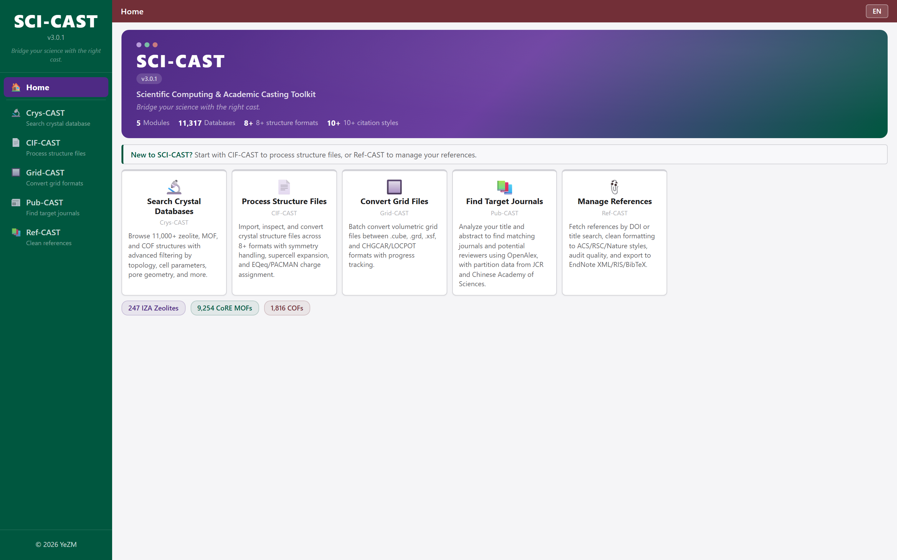
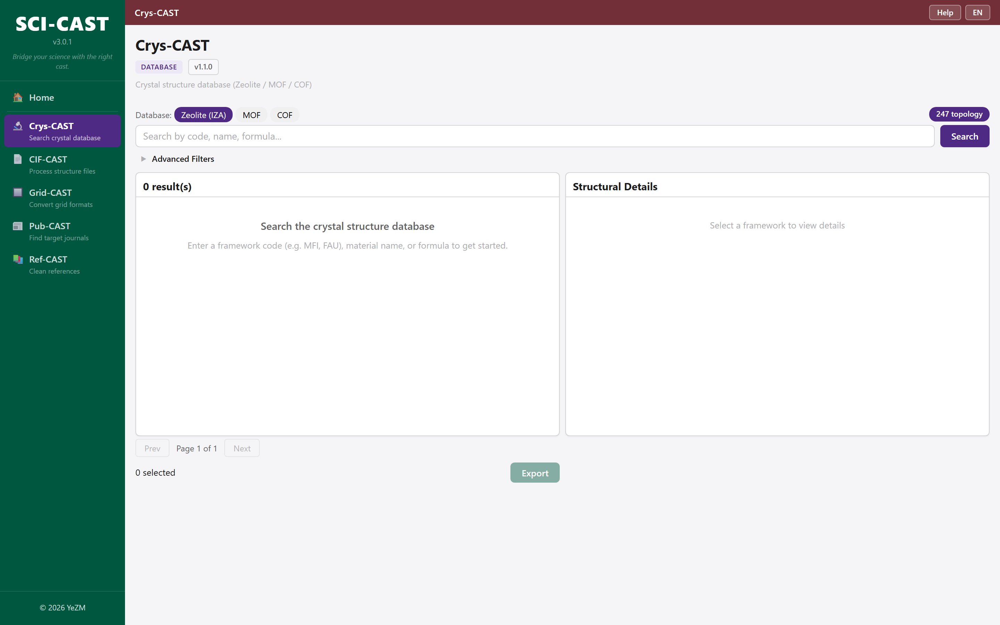
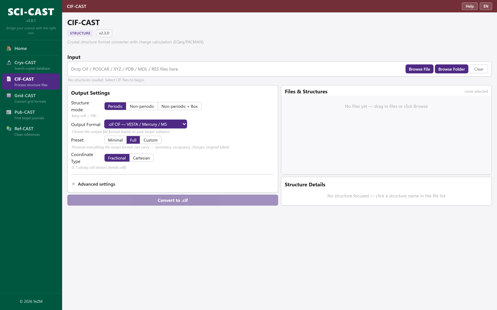
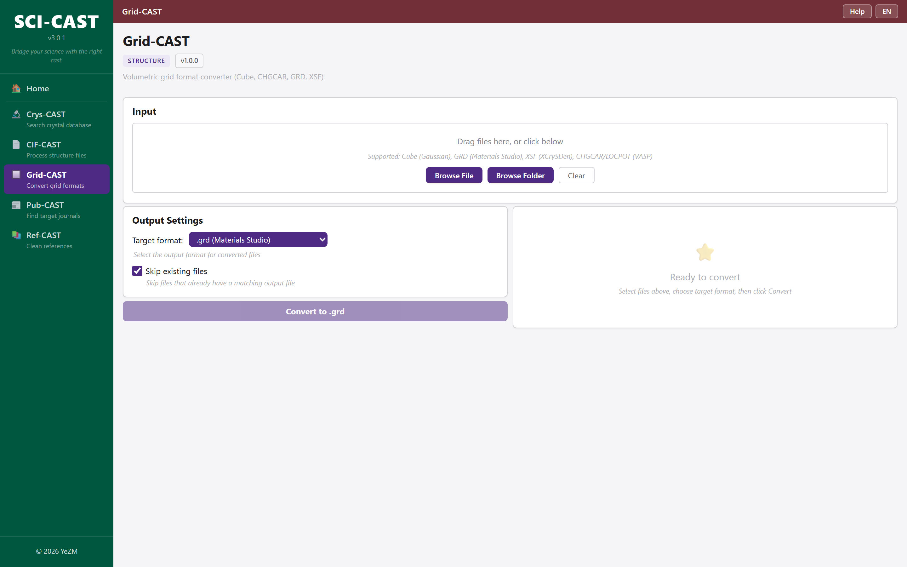
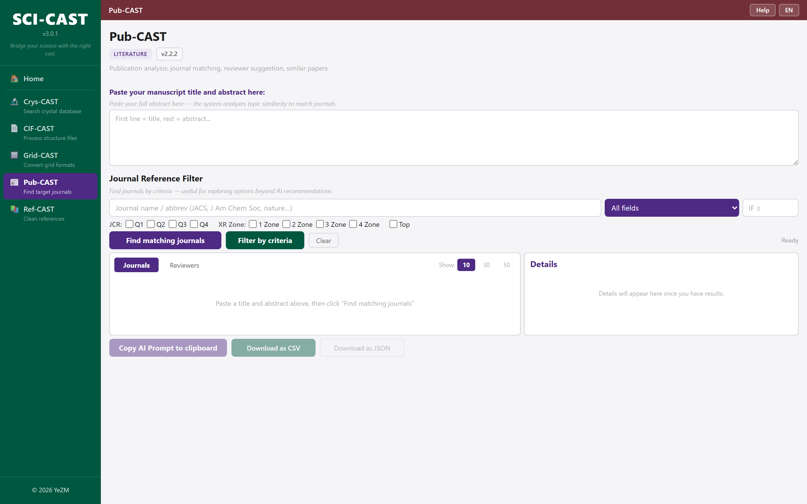
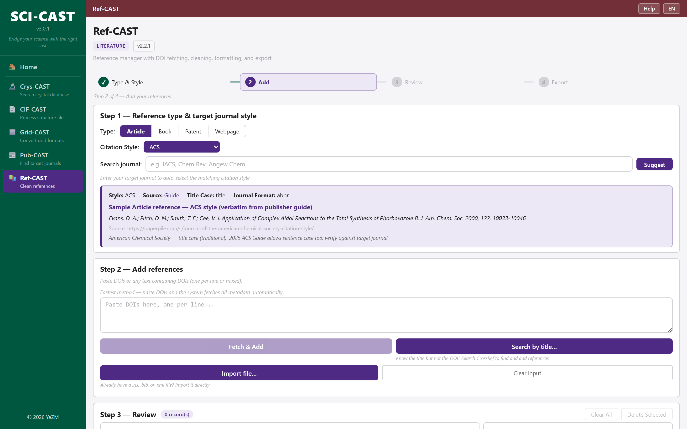

<p align="center">
  
</p>

<h1 align="center">SCI-CAST</h1>

<p align="center">
  <b>Scientific Computing & Academic Casting Toolkit</b><br>
  <i>Bridge your science with the right cast.</i>
</p>

<p align="center">
  <a href="https://github.com/ye-zi-ming/SCI-CAST/releases/tag/v3.2.0">
    
  </a>
  &nbsp;
  <a href="LICENSE">
    
  </a>
  &nbsp;
  
</p>

<p align="center">
  <b>Download → Unzip → Double-click SCI-CAST.exe → Done.</b><br>
  下载 → 解压 → 双击 SCI-CAST.exe → 开始使用。无需安装任何依赖。
</p>

<p align="center">
  <a href="https://github.com/ye-zi-ming/SCI-CAST/releases/download/v3.2.0/SCI-CAST_v3.2.0_Windows_x64.zip">
    <b>📦 Download SCI-CAST v3.2.0 (Windows x64, ~550 MB)</b>
  </a>
</p>

---

## What is SCI-CAST? / 这是什么？

SCI-CAST is an all-in-one desktop toolkit for computational chemistry researchers. It combines five modules that cover the most common daily tasks — from crystal structure lookup and file conversion, to journal selection and reference formatting — in a single, offline-ready application.

SCI-CAST 是一款面向计算化学研究者的一站式桌面工具箱。它将五个模块整合在一个离线可用的应用中，覆盖日常最常见的任务：晶体结构检索、文件格式转换、目标期刊筛选、参考文献整理。

**No Python. No command line. No configuration. Just double-click and go.**

**不需要 Python，不需要命令行，不需要配置。双击即用。**

---

## Five Modules / 五大模块

### 🔬 Crys-CAST — Crystal Structure Database / 晶体结构数据库

<p align="center"></p>

Search **10,000+ zeolite, MOF, and COF** crystal structures locally, with no internet required.

在本地离线检索 **10,000+** 沸石、MOF 和 COF 晶体结构。

- Search by common name — MOF-5, HKUST-1, UiO-66, ZIF-8, MFI … / 按常用名搜索
- Advanced filters — crystal system, cell parameters (±%), topology, metal, PLD, LCD, surface area / 晶系、晶胞参数、拓扑、金属、PLD、LCD 等高级筛选
- One-click CIF download or batch export (CIF + CSV zip) / 单击下载 CIF 或批量导出

| Database | Structures |
|----------|-----------|
| Zeolite | 200+ topologies |
| MOF | 10,000+ |
| COF | 1,000+ |

---

### 🔄 CIF-CAST — Structure File Converter / 结构文件转换

<p align="center"></p>

Convert crystal structure files between **10+ formats** with one click.

一键转换 **10+** 种晶体结构文件格式。

| | Formats |
|---|---|
| **Input** | CIF, POSCAR, XDATCAR, XYZ, ExtXYZ, PDB, MOL, SDF, RES, LAMMPS dump |
| **Output** | CIF, POSCAR, RES, PDB, ExtXYZ, XYZ, MOL, SDF |

- Supercell generation (a × b × c) / 超胞生成
- Symmetry expansion to P1 / 对称性展开
- Multi-file batch mode / 多文件批量模式
- Charge calculation: EQeq (built-in) & PACMAN (DDEC6/Bader/CM5/REPEAT) / 电荷计算

---

### 📐 Grid-CAST — Grid File Converter / 网格文件转换

<p align="center"></p>

Batch convert volumetric grid files with progress tracking.

批量转换体积网格文件，带实时进度条。

**.cube** ↔ **CHGCAR/LOCPOT** ↔ **.grd** ↔ **.xsf**

Supports Gaussian, CP2K, ORCA, VASP, Materials Studio, Quantum ESPRESSO, XCrySDen.

---

### 📊 Pub-CAST — Journal Matching & Reviewer Discovery / 期刊匹配与审稿人发现

<p align="center"></p>

Paste your title + abstract → get ranked journal recommendations and reviewer candidates.

粘贴标题和摘要 → 获得排序后的候选期刊与审稿人推荐。

- **Pub-Match** — Manuscript → journal candidates + reviewer shortlists (with IF, quartile, zone) / 稿件 → 候选期刊 + 审稿人（附 IF、分区）
- **Ref-Filter** — Browse 22,000+ journals by name, field, impact factor / 浏览 22,000+ 期刊分区数据库
- Your manuscript text never leaves your machine / 稿件内容不会离开本机

---

### 📝 Ref-CAST — Reference Manager / 参考文献管理

<p align="center"></p>

Fetch, clean, and format references for any major publisher in seconds.

几秒内获取、清洗和格式化参考文献，适配各大出版社。

- **4 input methods** — DOI fetch, title search, file import (RIS/BibTeX/XML), manual entry / DOI、标题搜索、文件导入、手动录入
- **10+ citation styles** — ACS, RSC, Wiley, Elsevier, Nature, Science, Springer, Frontiers, MDPI, Cell Press … / 10+ 种引用样式
- **Quality audit** — Red/yellow/green grading with issue highlighting / 红黄绿质量审核 + 问题高亮
- **Export** — EndNote XML, RIS, BibTeX / 导出

---

## Getting Started / 快速上手

<table>
<tr><td>1.</td><td><a href="https://github.com/ye-zi-ming/SCI-CAST/releases/download/v3.2.0/SCI-CAST_v3.2.0_Windows_x64.zip"><b>Download the zip</b></a> (~550 MB) / 下载压缩包</td></tr>
<tr><td>2.</td><td>Extract to any folder / 解压到任意文件夹</td></tr>
<tr><td>3.</td><td>Double-click <b>SCI-CAST.exe</b> / 双击运行</td></tr>
</table>

**Requirements / 系统要求**: Windows 10/11 (64-bit). [WebView2 Runtime](https://developer.microsoft.com/en-us/microsoft-edge/webview2/) (pre-installed on most systems / 多数系统已自带).

---

## Roadmap / 开发计划

- [x] Crystal structure database with 10,000+ entries / 10,000+ 晶体结构数据库
- [x] 10+ structure file format conversion / 10+ 种结构文件格式互转
- [x] Journal matching & reviewer discovery / 期刊匹配与审稿人发现
- [x] Reference cleanup for 10+ publisher styles / 10+ 出版社引用样式清洗
- [ ] PXRD-CAST — Powder XRD pattern simulation & matching / 粉末 XRD 模拟与匹配
- [ ] More database integrations / 更多数据库集成

---

## Citation / 引用

If SCI-CAST helps your research, a citation is appreciated:

如果 SCI-CAST 对您的研究有帮助，欢迎引用：

```
YeZM. SCI-CAST: Scientific Toolkit for Computational Chemistry
& Publication Workflows, v3.2.0, 2026.
https://github.com/ye-zi-ming/SCI-CAST
```

---

## Author / 作者

**YeZM**

[Google Scholar](https://scholar.google.com/citations?user=LQAiqTIAAAAJ&hl=en) · [ORCID](https://orcid.org/0000-0001-6728-2952) · [GitHub](https://github.com/ye-zi-ming)

A researcher who spent too many years switching between the bench and the terminal. SCI-CAST grew out of scattered scripts and small tools — finally put together into one place.

一个在实验台和电脑之间来回切换了太多年的科研人。SCI-CAST 源于多年零散的脚本和小工具——终于整合到了一处。

---

<p align="center">
  <b>Free for academic & personal use</b> · 学术与个人用途免费<br>
  <a href="LICENSE">GPL-3.0 License</a> · © 2026 YeZM
</p>
